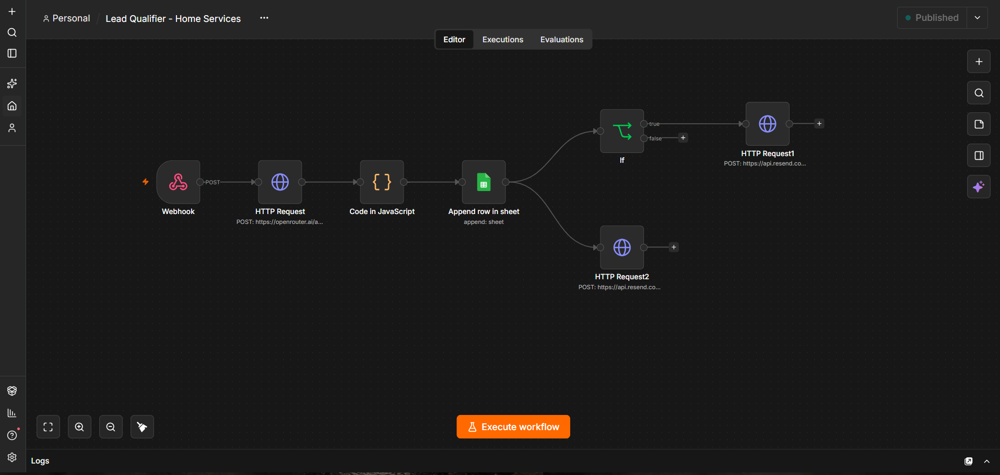
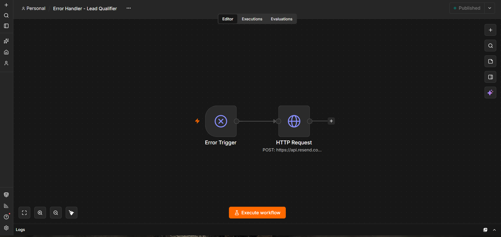
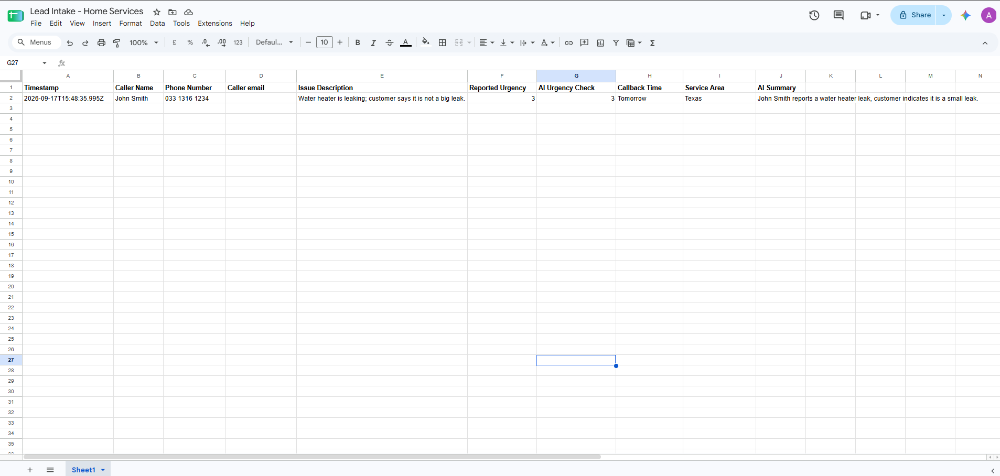
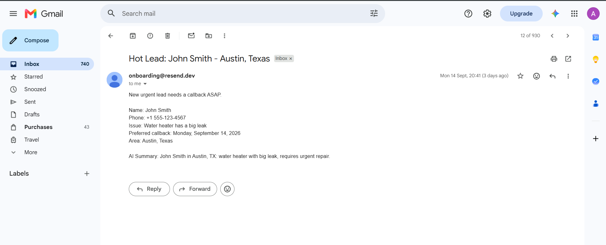
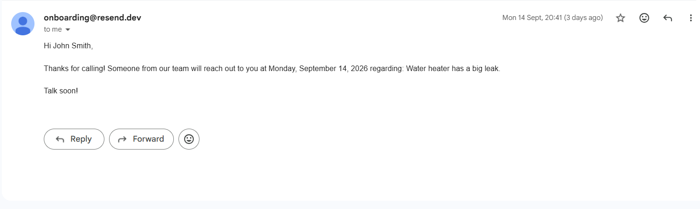

# AI Voice Lead Intake Automation

An end to end AI voice receptionist and lead intake automation built with **Retell AI** and **n8n** for home service businesses.

The system handles inbound customer calls, collects lead information, classifies lead urgency, logs the lead, and automatically sends the appropriate email notifications.

## Architecture

```text
Customer Call
     │
     ▼
Retell AI Voice Agent
     │
     │  Lead information
     ▼
n8n Webhook
     │
     ▼
LLM Data Extraction
     │
     ▼
Google Sheets
     │
     ├──────────────► Customer Confirmation Email
     │
     ▼
Urgency Check
     │
     └── Urgency ≥ 4 ──► Hot Lead Notification
```

## What It Does

The AI receptionist collects:

* Caller name
* Phone number
* Email address
* Issue description
* Urgency level (1–5)
* Service area
* Preferred callback time

The information is then sent from Retell AI to an n8n webhook.

n8n processes the incoming data and:

1. Extracts and structures the lead information using an LLM.
2. Adds the lead to Google Sheets.
3. Checks the reported urgency.
4. Sends a hot lead notification when urgency is **4 or higher**.
5. Sends a confirmation email to the customer.

## Workflow Components

### 1. Retell AI

Handles the voice conversation with the customer.

The agent is responsible for collecting the required lead information and sending it to the automation through a custom function.

### 2. n8n

Acts as the automation backend.

The workflow receives the webhook request, processes the data, logs the lead, evaluates urgency, and triggers the appropriate email actions.

### 3. LLM Processing

An LLM is used to extract and structure the information received from the voice agent into consistent lead fields.

### 4. Google Sheets

Acts as the lead storage layer for this demonstration.

Each completed call creates a structured lead record.

### 5. Email Automation

Two email paths are implemented:

**Customer confirmation**

Every successfully processed lead receives a confirmation email.

**Hot lead notification**

Leads with an urgency level of **4 or 5** trigger an additional notification for the business.

## Example Use Case

A customer calls a home-service company and says they have an urgent problem.

The AI receptionist gathers the customer's:

```text
Name
Phone
Email
Problem
Urgency
Service Area
Callback Preference
```

The information is sent to n8n.

If the urgency is high, the business receives a hot-lead notification while the customer receives a confirmation email.

For a normal-priority lead, the lead is still logged and the customer receives their confirmation, but no hot-lead notification is triggered.

## Testing

The workflow was tested with both normal priority and high priority leads.

### Normal Lead

* Lead successfully received by n8n
* Lead logged in Google Sheets
* Customer confirmation email sent
* Hot lead notification not triggered

### Hot Lead

* Lead successfully received by n8n
* Lead logged in Google Sheets
* Customer confirmation email sent
* Hot lead notification triggered

## Screenshots

### n8n Workflow



### Error Handler



### Lead Logged in Google Sheets



### Hot Lead Notification



### Customer Confirmation




## Tech Stack

* **Retell AI** — AI voice agent
* **n8n** — workflow automation
* **OpenRouter / LLM** — lead data extraction
* **Google Sheets** — lead storage
* **Resend** — transactional email
* **Webhooks / REST APIs** — system integration
* **Docker** — local n8n environment

## Key Automation Concepts Demonstrated

* AI voice agents
* Webhook-based integrations
* REST APIs
* LLM-powered data extraction
* Conditional workflow branching
* Lead qualification
* Automated notifications
* Transactional email
* Google Sheets integration
* Error aware workflow design
* End-to-end workflow testing

## Security

This repository contains a **sanitized workflow export** for demonstration purposes.

Credentials, API keys, private webhook identifiers, personal email addresses, and other environment specific identifiers have been removed or replaced with placeholders.

No production credentials are included in this repository.

## Project Structure

```text
ai-voice-lead-intake-automation/
│
├── workflow.json
├── README.md
├── .gitignore
└── screenshots/
    ├── n8n-workflow.png
    ├── google-sheets.png
    ├── hot-lead-email.png
    └── customer-confirmation.png
```

## Purpose

This project demonstrates how an AI voice agent can be connected to an automation backend to turn phone conversations into structured, actionable business leads.

The same architecture can be adapted for other industries such as:

* HVAC
* Plumbing
* Electrical services
* Roofing
* Landscaping
* Cleaning services
* Automotive services
* Other appointment or lead-based businesses